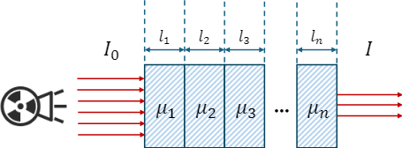

## 理想CT图像的投影
CT的成像是通过探测X射线在人体内的衰减来实现的。因为人体的不同组织对X射线的衰减系数不同，所以如果我们能够测量出不同组织对X射线的衰减系数，也就相当于得到了人体内部的结构信息。

如图1所示，我们假设入射光的强度为$I_0$，经过一个均匀分布的测量物体后探测到的光强为$I$，那么根据[Beer-Lambert定律](https://zh.wikipedia.org/wiki/%E6%AF%94%E5%B0%94-%E6%9C%97%E4%BC%AF%E5%AE%9A%E5%BE%8B)，X射线衰减后所具有的光强可以表示为：
$$I = I_0 \cdot e^{-\mu l} \tag{1}$$
其中，$\mu$是物体的线性衰减系数，$l$表示射线穿过物体的直线长度。
<figure>
  
  <figcaption>图1 X 射线穿过单个均匀介质示意图</figcaption>
</figure>
<!-- more -->

对式(1)进行对数变换，可以得到：
$$ \mu l = -\ln\left(\frac{I_0}{I}\right) \tag{2}$$
式(2)中的$-\ln\left(\frac{I_0}{I}\right)$是我们可以测量得到的，它的值就是我们平时所说的投影值（projection value）。即：
$$p = -\ln\left(\frac{I_0}{I}\right) = \mu l \tag{3}$$
当然，我们这里讨论的只是一个均匀介质的情况，实际上自然界的物体几乎没有均匀的分布，都是由多种组织构成的复杂结构，所以我们需要对物体进行离散化处理，将其划分为多个分段均匀的小体素（voxel），每个体素具有不同的衰减系数$\mu_i$。如图2所示，X射线穿过物体时，其投影值可以表示为：
$$p = \sum_{i} \mu_i l_i \tag{4}$$
其中，$l_i$表示X射线在第$i$个体素中的路径长度。
<figure>
  
  <figcaption>图2 X 射线穿过多种介质示意图</figcaption>
</figure>

更一般地，人体的结构更加复杂，衰减系数$\mu$是一个二维函数$\mu(x,y)$，表示在不同位置的衰减系数不同。那么投影值$p$可以表示为沿着X射线方向对衰减系数进行积分：
$$p = \int_{L} \mu(x,y) dl \tag{5}$$

由于我们这里是讨论加噪的问题，为了表示形式上的简洁，在后续的讨论中，我们仍然使用式(2)中的形式来表示投影值$p$，但需要注意的是，实际计算中需要考虑人体的复杂结构。

## 实际场景中的CT投影
在实际的CT扫描过程中，由于光子是以离散的粒子形式存在的，存在量子效应，因此探测器接收到的光子数量是一个随机变量，通常服从泊松分布（Poisson distribution）：
$$N \sim \text{Poisson}(\lambda) \tag{6}$$
其中，$\lambda$表示期望接收到的光子数量，也就是在没有噪声的理想情况下，探测器接收到的光子数量。由于光强$I$与接收到的光子数量$N$成正比关系，我们可以将式(6)中的$N$替换为$I$，结合式(1)，式(6)可以得到：
$$I \sim \text{Poisson}(\lambda) \tag{7}$$

> **为什么说光子数量服从泊松分布？**
>
> 泊松分布（Poisson Distribution）描述的是：在固定时间或空间内，独立事件发生的次数的概率分布。X射线光子从源发出，穿过人体组织，最终到达探测器的过程，完全满足泊松过程的三个核心假设：
> 1. **独立性**：一个光子是否被探测到，与之前或之后的光子无关。每个光子的路径、衰减、探测都是相互独立的随机事件。
> 2. **稀疏性**：在极短的时间间隔内，最多只有一个光子被探测到。虽然光源发射的光子流很密集，但探测器对每个光子的响应是离散的、瞬时的。因此，在一个足够小的时间窗口内，可以认为最多只发生一次“探测事件”。
> 3. **均匀性**：在固定的扫描条件下（如管电压、管电流、曝光时间），单位时间内到达探测器的平均光子数$\lambda$是恒定的。
> 这三个假设完美地契合了X射线光子计数的物理过程，因此，探测器在单位时间内接收到的光子数服从泊松分布。

又:
- 根据式(1)中$I_0 \cdot e^{-\mu l}$表示在理想情况下探测器接收到的光子数量，所以我们可以将其视为泊松分布的参数$\lambda$。
- 根据式(3)中理想情况下的投影：$p_{\text{ICT}} = \mu l$，我们可以得到$\lambda = I_0 \cdot e^{-p_{\text{ICT}}}$。
因此，式(7)可以改写为：
$$I \sim \text{Poisson}(I_0 \cdot e^{-p_{\text{ICT}}}) \tag{8}$$

这时，我们可以从泊松分布中采样，得到实际探测到的光子数量$I_{actual}$：
$$I_{actual} = \text{Poisson}(I_0 \cdot e^{-p_{\text{ICT}}}) \tag{9}$$
最后，我们可以根据实际探测到的光子数量$I_{actual}$，计算出实际的投影值$p_{\text{CT}}$：
$$p_{\text{CT}} = -\ln\left(\frac{I_0}{I_{actual}}\right) \tag{10}$$

## 总结

**泊松噪声是X射线成像的物理本质**。从式(6)~(10)可以看出，无论剂量高低，只要我们用X射线光子来成像，探测器接收到的光子数量就天然地、不可避免地服从泊松分布。这是由量子力学的基本原理决定的，是光子的粒子性和随机性的直接体现。所以，泊松噪声是CT成像固有的、内在的物理属性。