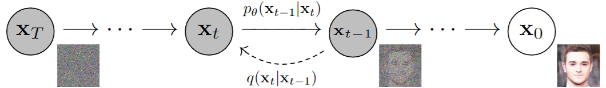
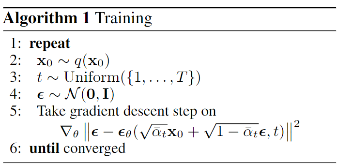

## 直观理解
<figure>
  
  <figcaption>图1 DDPM示意图</figcaption>
</figure>

借鉴[苏剑林拆楼建楼](https://kexue.fm/archives/9119)的比喻，扩散模型包含“拆楼”和“建楼”两个相反的过程，拆楼是为了更好的建楼，核心的思想是从一堆材料出发去直接一步建成一个楼是比较困难的，但是如果我们有已经建好的楼，一步步将其拆除，将拆除过程中的每一对中间过程$(x_t,x_{t-1})$记下来，那么建楼的过程就被分解成了在上一步的基础上，添加被拆掉的那一部分，就可以恢复被拆之前的楼的结构，问题就变得简单了。
- 前向过程就是将一个完整的楼$x_0$通过T步拆解，逐步变成原材料$x_T$的过程：
  $x_0\rightarrow x_1\rightarrow x_2\rightarrow x_3\cdots \rightarrow x_T$，中间的每一步都可以表示为$x_{t-1}\rightarrow x_t: q(x_t|x_{t-1})$
- 反向过程就是从原材料$x_T$开始，一步步建楼，逐步建成完整的楼$x_0$的过程：
  $x_T\rightarrow \cdots \rightarrow x_3 \rightarrow x_2 \rightarrow x_1 \rightarrow x_0$，中间的每一步都可以表示为$x_t \rightarrow x_{t-1}:p_\theta(x_{t-1}|x_t)$

## 扩散过程（前向过程）
回到图像上来，DDPM的作者将“拆楼”的过程实现为逐步在一张清晰的图像$x_0$上加高斯噪声$\epsilon_t$使其退化，这个过程也被称为扩散过程（Diffusion Process），在$T$步扩散之后，清晰图像$x_0$最终退化为纯高斯噪声$\epsilon_T\sim\mathcal{N}(0,\mathbf{I})$。退化的每一步可以表示为：
$$\begin{equation}
x_t = \alpha_t x_{t-1} + \beta_t \epsilon_t,\quad \alpha_t,\beta_t>0\, 并且 \, \alpha_t^2+\beta_t^2=1 \tag{1}
\end{equation}$$

<!-- more -->
这里的$\alpha_t x_{t-1}$可以直观理解为第$t$步拆除之后剩余的楼体的部分，$\beta_t \epsilon_t$可以理解为拆楼得到的原材料。反复执行扩散过程，可以得到：
$$
\begin{align}
x_t &= \alpha_t x_{t-1} + \beta_t \epsilon_t \\
&= \alpha_t (\alpha_{t-1}x_{t-2}+\beta_{t-1}\epsilon_{t-1}) + \beta_t \epsilon_t \\
&=\alpha_t\alpha_{t-1}x_{t-2}+\alpha_t\beta_{t-1}\epsilon_{t-1} + \beta_t \epsilon_t \\
&=\alpha_t\alpha_{t-1}(\alpha_{t-2}x_{t-3}+\beta_{t-2}\epsilon_{t-2})+\alpha_t\beta_{t-1}\epsilon_{t-1} + \beta_t \epsilon_t \\
&=\alpha_t\alpha_{t-1}\alpha_{t-2}x_{t-3}+\alpha_t\alpha_{t-1}\beta_{t-2}\epsilon_{t-2}+\alpha_t\beta_{t-1}\epsilon_{t-1} + \beta_t \epsilon_t \\
&=\cdots \\
&=\textcolor{green}{(\alpha_t\alpha_{t-1}\cdots\alpha_1)x_0} \\
&\quad+\textcolor{red}{(\alpha_t\alpha_{t-1}\cdots\alpha_2\beta_1)\epsilon_1+(\alpha_t\alpha_{t-1}\cdots\alpha_3\beta_2)\epsilon_2 + \cdots + (\alpha_t\beta_{t-1})\epsilon_{t-1} + \beta_t\epsilon_t}
\end{align} \tag{2}
$$

可以发现，每一个中间结果$x_t$都可以用最初的清晰图像$x_0$加上一堆独立的高斯噪声表示。红色部分其实是均值为$0$，方差分别为$(\alpha_t\alpha_{t-1}\cdots\alpha_2)^2\beta_1^2$、$(\alpha_t\alpha_{t-1}\cdots\alpha_3)^2\beta_2^2$、$\cdots$、$\alpha_t^2\beta_{t-1}^2$、$\beta_t^2$的独立高斯噪声的和，根据高斯分布的可叠加性，红色部分可以改写为下面的等价形式：
$$
\begin{align}
&(\alpha_t\alpha_{t-1}\cdots\alpha_2\beta_1)\epsilon_1+(\alpha_t\alpha_{t-1}\cdots\alpha_3\beta_2)\epsilon_2 + \cdots + (\alpha_t\beta_{t-1})\epsilon_{t-1} + \beta_t\epsilon_t \\
=&\small\sqrt{(\alpha_t\alpha_{t-1}\cdots\alpha_2)^2\beta_1^2+(\alpha_t\alpha_{t-1}\cdots\alpha_3)^2\beta_2^2+\cdots+\alpha_t^2\beta_{t-1}^2+\beta_t^2}\cdot\bar{\epsilon}_t,\quad  \bar{\epsilon}_t \sim \mathcal{N}(0,\mathbf{I})
\end{align} \tag{3}
$$
下面单独计算根号下的部分，为了计算方便，我们给根号下的部分先加上一个$(\alpha_t\alpha_{t-1}\cdots\alpha_2\alpha_1)^2$，再减去$(\alpha_t\alpha_{t-1}\cdots\alpha_2\alpha_1)^2$
$$
\begin{align}
&\quad(\alpha_t\alpha_{t-1}\cdots\alpha_2)^2\beta_1^2+(\alpha_t\alpha_{t-1}\cdots\alpha_3)^2\beta_2^2+\cdots+\alpha_t^2\beta_{t-1}^2+\beta_t^2 \\
&=\small\textcolor{red}{(\alpha_t\alpha_{t-1}\cdots\alpha_2\alpha_1)^2+}(\alpha_t\alpha_{t-1}\cdots\alpha_2)^2\beta_1^2+(\alpha_t\alpha_{t-1}\cdots\alpha_3)^2\beta_2^2+\cdots+\alpha_t^2\beta_{t-1}^2+\beta_t^2 \\
&\quad\textcolor{red}{-(\alpha_t\alpha_{t-1}\cdots\alpha_2\alpha_1)^2} \\
\end{align} \tag{4}
$$

前两项先提取公共项：$(\alpha_t\alpha_{t-1}\cdots\alpha_2)^2$，得到：
$$
\small(\alpha_t\alpha_{t-1}\cdots\alpha_2)^2\textcolor{blue}{(\alpha_1^2+\beta_1^2)}+(\alpha_t\alpha_{t-1}\cdots\alpha_3)^2\beta_2^2+\cdots+\alpha_t^2\beta_{t-1}^2+\beta_t^2-(\alpha_t\alpha_{t-1}\cdots\alpha_2\alpha_1)^2 
\tag{5}
$$

因为我们定义假设$\alpha_t^2+\beta_t^2=1$，所以$\alpha_1^2+\beta_1^2=1$，可以得到：
$$\begin{equation}
\begin{aligned}
&\quad(\alpha_t\alpha_{t-1}\cdots\alpha_2)^2+(\alpha_t\alpha_{t-1}\cdots\alpha_3)^2\beta_2^2+\cdots+\alpha_t^2\beta_{t-1}^2+\beta_t^2-(\alpha_t\alpha_{t-1}\cdots\alpha_2\alpha_1)^2 \\
\end{aligned}  \tag{6}
\end{equation}$$

同样地，再提取前两项的公共项：$(\alpha_t\alpha_{t-1}\cdots\alpha_3)^2$，得到：
$$\begin{equation}
\begin{aligned}
&\quad(\alpha_t\alpha_{t-1}\cdots\alpha_3)^2\textcolor{blue}{(\alpha_2^2+\beta_2^2)}+\cdots+\alpha_t^2\beta_{t-1}^2+\beta_t^2-(\alpha_t\alpha_{t-1}\cdots\alpha_2\alpha_1)^2 \\
&=(\alpha_t\alpha_{t-1}\cdots\alpha_3)^2+\cdots+\alpha_t^2\beta_{t-1}^2+\beta_t^2-(\alpha_t\alpha_{t-1}\cdots\alpha_2\alpha_1)^2
\end{aligned} \tag{7}
\end{equation}$$

以此类推，可以得到：
$$\begin{equation}
\begin{aligned}
&\quad(\alpha_t\alpha_{t-1}\cdots\alpha_2)^2\beta_1^2+(\alpha_t\alpha_{t-1}\cdots\alpha_3)^2\beta_2^2+\cdots+\alpha_t^2\beta_{t-1}^2+\beta_t^2 \\
&= \textcolor{blue}{(\alpha_t^2+\beta_t^2)}-(\alpha_t\alpha_{t-1}\cdots\alpha_2\alpha_1)^2 \\
&=1-(\alpha_t\alpha_{t-1}\cdots\alpha_2\alpha_1)^2
\end{aligned} \tag{8}
\end{equation}$$

所以:
$$\begin{equation}
\begin{aligned}
x_t &= \alpha_t x_{t-1} + \beta_t \epsilon_t \\
&=\small\textcolor{green}{(\alpha_t\alpha_{t-1}\cdots\alpha_1)x_0}+\textcolor{red}{(\alpha_t\alpha_{t-1}\cdots\alpha_2\beta_1)\epsilon_1+(\alpha_t\alpha_{t-1}\cdots\alpha_3\beta_2)\epsilon_2 + \cdots + (\alpha_t\beta_{t-1})\epsilon_{t-1} + \beta_t\epsilon_t} \\
&=\small\textcolor{green}{(\alpha_t\alpha_{t-1}\cdots\alpha_1)x_0}+\textcolor{red}{\sqrt{(\alpha_t\alpha_{t-1}\cdots\alpha_2)^2\beta_1^2+(\alpha_t\alpha_{t-1}\cdots\alpha_3)^2\beta_2^2+\cdots+\alpha_t^2\beta_{t-1}^2+\beta_t^2}\cdot\bar{\epsilon}_t} \\
&=\textcolor{green}{(\alpha_t\alpha_{t-1}\cdots\alpha_1)x_0} + \textcolor{red}{\sqrt{1-(\alpha_t\alpha_{t-1}\cdots\alpha_2\alpha_1)^2}\cdot\bar{\epsilon}_t}
\end{aligned} \tag{9}
\end{equation}$$

令：$\bar{\alpha}_t=(\alpha_t\alpha_{t-1}\cdots\alpha_2\alpha_1)^2$，则：
$$\begin{equation}
\begin{aligned}
x_t &= \alpha_t x_{t-1} + \beta_t \epsilon_t \\
&=\textcolor{green}{(\alpha_t\alpha_{t-1}\cdots\alpha_1)x_0} + \textcolor{red}{\sqrt{1-(\alpha_t\alpha_{t-1}\cdots\alpha_2\alpha_1)^2}\cdot\bar{\epsilon}_t}\\
&=\sqrt{\bar{\alpha}_t}x_0+\sqrt{1-\bar{\alpha}_t}\bar{\epsilon}_t
\end{aligned} \tag{10}
\end{equation}$$

至此，我们就得到了DDPM的前向公式$x_t=\sqrt{\bar{\alpha}_t}x_0+\sqrt{1-\bar{\alpha}_t}\bar{\epsilon}_t$，这个公式定义我们如何从输入的清晰图像$x_0$通过一步加噪就可以得到任意一个中间结果$x_t$，省去了扩散过程中的高斯噪声的采样的次数。
而且，只要设计合理的$\bar{\alpha}_t$，使得在$T\to +\infty$时，$\bar{\alpha}_T\to 0$且$T\to 0$时，$\bar{\alpha}_T\to 1$，就可以保证扩散过程开始于清晰图像，结束于纯高斯噪声$\epsilon_T$。

## 去噪过程（反向过程）
DDPM的目的不是为了给清晰图像加噪声，而是反过来，从纯高斯噪声出发，逐步生成与$x_0$属于同一分布的图像（长得像$x_0$的图像），即：$\epsilon_T \to x_T \to x_{T-1} \to \cdots \to x_1 \to x_0$。

再看看公式(10)，有了扩散的拆楼公式，我们就可以很容易（一步采样）计算出每一个中间的结果$x_t$，而且可以得到很多的相邻的中间结果的数据对$\{(x_t,x_{t-1})\}_{t=1}^T$。

为了确定每一步的楼是怎么建，既然有了数据，我们很自然可以想到，使用前向过程得到的数据学习一个网络（假设模型是$\mu_\theta$）来学习去噪（建楼）的过程$\mu_\theta(x_t)$：

学习的方式可以使用MSE，即：
$$\begin{equation}
\|x_{t-1}-\mu_\theta(x_t)\|^2 \tag{11}
\end{equation}$$

公式(1)可以写成：
$$\begin{equation}
x_{t-1}=\frac{1}{\alpha_t}(x_t-\beta_t\epsilon_t) \tag{12}
\end{equation}$$

为了使得训练更加稳定，原来预测图像的$\mu_\theta(x_t)$可以设计成预测noise的$\epsilon_\theta(x_t, t)$，即：
$$\begin{equation}
\mu_\theta(x_t):=\frac{1}{\alpha_t}(x_t-\beta_t\epsilon_\theta(x_t, t)) \tag{13}
\end{equation}$$

带入到损失函数(11)中，可以得到：
$$\begin{equation}
\begin{aligned}
&\quad\|x_{t-1}-\frac{1}{\alpha_t}(x_t-\beta_t\epsilon_\theta(x_t, t))\|^2 \\
&=\|\frac{1}{\alpha_t}(x_t-\beta_t\epsilon_t)-\frac{1}{\alpha_t}(x_t-\beta_t\epsilon_\theta(x_t, t))\|^2 \\
&=\frac{\beta_t^2}{\alpha_t^2}\|\epsilon_t-\epsilon_\theta(x_t, t)\|^2
\end{aligned} \tag{14}
\end{equation}$$

其中$x_t$可以计算出来：
$$\begin{equation}
\begin{aligned}
x_t &= \alpha_t x_{t-1} + \beta_t \epsilon_t  \\
&= \alpha_t(\sqrt{\bar{\alpha}_{t-1}}x_0+\sqrt{1-\bar{\alpha}_{t-1}}\bar{\epsilon}_{t-1}) + \beta_t \epsilon_t \\
&=\sqrt{\bar{\alpha}_t}x_0+\alpha_t\sqrt{1-\bar{\alpha}_{t-1}}\bar{\epsilon}_{t-1} + \beta_t \epsilon_t
\end{aligned} \tag{15}
\end{equation}$$

> 这里的$x_t$为什么不直接用公式(10)的形式$\sqrt{\bar{\alpha}_t}x_0+\sqrt{1-\bar{\alpha}_t}\bar{\epsilon}_t$来表示，而是要退回到公式(1)的形式$\alpha_t x_{t-1} + \beta_t \epsilon_t$来表示呢？
> 
> 因为在公式(14)中，我们已经事先采样了一个$\epsilon_t$，而从公式(9)的定义我们知道$\bar{\epsilon}_t$和$\epsilon_t$不是相互独立的，我们不能在已经采样了$\epsilon_t$的情况下再去独立的采样一个$\bar{\epsilon}_t$，所以只能退回到公式(1)的形式来表示$x_t$。

代入公式(14)的loss函数中，可以得到：
$$\begin{equation}
\begin{aligned}
&\quad\|x_{t-1}-\frac{1}{\alpha_t}(x_t-\beta_t\epsilon_\theta(x_t, t))\|^2 \\
&=\|\frac{1}{\alpha_t}(x_t-\beta_t\epsilon_t)-\frac{1}{\alpha_t}(x_t-\beta_t\epsilon_\theta(x_t, t))\|^2 \\
&=\frac{\beta_t^2}{\alpha_t^2}\|\epsilon_t-\epsilon_\theta(\sqrt{\bar{\alpha}_t}x_0+\alpha_t\sqrt{1-\bar{\alpha}_{t-1}}\bar{\epsilon}_{t-1} + \beta_t \epsilon_t, t)\|^2
\end{aligned} \tag{16}
\end{equation}$$

## 降低方差
理论上通过公式(16)就可以训练DDPM了，但实际上可能存在方差过大的风险，因为公式(16)中有四个需要采样的随机变量：
1. 从所有训练样本中采样一个$x_0$
2. 从高斯分布中采样$\bar{\epsilon}_{t-1},\epsilon_t$ 
3. 从$1\sim T$中采样一个$t$

要采样的随机变量越多，就越难对损失函数做准确的估计，反过来说就是每次对损失函数进行估计的波动（方差）过大了。

解决思路：利用高斯分布的叠加性，将$\bar{\epsilon}_{t-1},\epsilon_t$合并。

(a) $\alpha_t\sqrt{1-\bar{\alpha}_{t-1}}\bar{\epsilon}_{t-1} + \beta_t \epsilon_t$是$\mathcal{N}(0,\alpha_t^2(1-\bar{\alpha}_{t-1}))$和$\mathcal{N}(0,\beta_t^2)$这两个高斯分布的和，那么叠加之后的高斯分布的均值是0，方差是$\alpha_t^2(1-\bar{\alpha}_{t-1}) + \beta_t^2$，展开计算一下：
$$\begin{equation}
\begin{aligned}
&\quad\alpha_t^2(1-\bar{\alpha}_{t-1}) + \beta_t^2 \\
&=\alpha_t^2+\beta_t^2-\alpha_t^2\bar{\alpha}_{t-1} \\
&=1-\alpha_t^2(\alpha_{t-1}\cdots\alpha_1)^2  \\
&=1-(\alpha_t\alpha_{t-1}\cdots\alpha_1)^2 \\
&=1-\bar{\alpha}_t
\end{aligned} \tag{17}
\end{equation}$$

即：
$$\begin{equation}
\alpha_t\sqrt{1-\bar{\alpha}_{t-1}}\bar{\epsilon}_{t-1} + \beta_t \epsilon_t = \sqrt{1-\bar{\alpha}_t}\epsilon \tag{a}
\end{equation}$$

(b) 我们可以构造另外一个跟$\bar{\epsilon}_{t-1},\epsilon_t$相关的高斯分布的叠加形式，例如：$\beta_t\bar{\epsilon}_{t-1} - \alpha_t\sqrt{1-\bar{\alpha}_{t-1}}\epsilon_t$，同样是$\mathcal{N}(0,\alpha_t^2(1-\bar{\alpha}_{t-1}))$和$\mathcal{N}(0,\beta_t^2)$这两个高斯分布的和，那么叠加之后的高斯分布的均值同样是0，方差也同样是$\alpha_t^2(1-\bar{\alpha}_{t-1}) + \beta_t^2$。即可以得到：
$$\begin{equation}
\beta_t\bar{\epsilon}_{t-1} - \alpha_t\sqrt{1-\bar{\alpha}_{t-1}}\epsilon_t = \sqrt{1-\bar{\alpha}_t}\omega\tag{b}
\end{equation}$$

综合(a)和(b)，我们可以得到一个方程组：
$$\begin{equation}
\begin{cases}
\alpha_t\sqrt{1-\bar{\alpha}_{t-1}}\bar{\epsilon}_{t-1} + \beta_t \epsilon_t = \sqrt{1-\bar{\alpha}_t}\epsilon \\
\beta_t\bar{\epsilon}_{t-1} - \alpha_t\sqrt{1-\bar{\alpha}_{t-1}}\epsilon_t = \sqrt{1-\bar{\alpha}_t}\omega \tag{18}
\end{cases}
\end{equation}$$

联立这个方程组，我们可以将$\epsilon_t$用$\epsilon,\omega$来表示，即：
$$\begin{equation}
\epsilon_t=\frac{\sqrt{1-\bar{\alpha}_t}(\beta_t\epsilon-\alpha_t\sqrt{1-\bar{\alpha}_{t-1}}\omega)}{\beta_t^2+\alpha_t^2(1-\bar{\alpha}_{t-1})}\tag{19}
\end{equation}$$

从公式(17)我们可以知道，公式(19)的分母可以化简为：$1-\bar{\alpha}_t$，即：
$$\begin{equation}
\epsilon_t=\frac{\sqrt{1-\bar{\alpha}_t}(\beta_t\epsilon-\alpha_t\sqrt{1-\bar{\alpha}_{t-1}}\omega)}{1-\bar{\alpha}_t}=\frac{\beta_t\epsilon-\alpha_t\sqrt{1-\bar{\alpha}_{t-1}}\omega}{\sqrt{1-\bar{\alpha}_t}}\tag{20} 
\end{equation}$$

所以公式(16)可以改写为：

$$\begin{equation}
\begin{aligned}
&\mathbb{E}_{x_0,t,\bar{\epsilon}_t,\epsilon_t\sim \mathcal{N}(0,\mathbf{I})}\left[\frac{\beta_t^2}{\alpha_t^2}\|\epsilon_t-\epsilon_\theta(\sqrt{\bar{\alpha}_t}x_0+\alpha_t\sqrt{1-\bar{\alpha}_{t-1}}\bar{\epsilon}_{t-1} + \beta_t \epsilon_t, t)\|^2\right] \\
=&\mathbb{E}_{x_0,t,\epsilon,\omega\sim \mathcal{N}(0,\mathbf{I})}\left[\frac{\beta_t^2}{\alpha_t^2}\|\frac{\beta_t\epsilon-\alpha_t\sqrt{1-\bar{\alpha}_{t-1}}\omega}{\sqrt{1-\bar{\alpha}_t}}-\epsilon_\theta(\sqrt{\bar{\alpha}_t}x_0+\sqrt{1-\bar{\alpha}_t}\epsilon, t)\|^2 \right]\\
=&\small\mathbb{E}_{x_0,t,\epsilon,\omega\sim \mathcal{N}(0,\mathbf{I})}\left[\frac{\beta_t^2}{\alpha_t^2}\|\frac{\beta_t}{\sqrt{1-\bar{\alpha}_t}}\epsilon-\frac{\alpha_t\sqrt{1-\bar{\alpha}_{t-1}}}{\sqrt{1-\bar{\alpha}_t}}\omega-\epsilon_\theta(\sqrt{\bar{\alpha}_t}x_0+\sqrt{1-\bar{\alpha}_t}\epsilon, t)\|^2 \right]
\end{aligned} \tag{21}
\end{equation}$$

展开平方项：
$$\begin{equation}
\begin{aligned}
&\|\frac{\beta_t}{\sqrt{1-\bar{\alpha}_t}}\epsilon-\frac{\alpha_t\sqrt{1-\bar{\alpha}_{t-1}}}{\sqrt{1-\bar{\alpha}_t}}\omega-\epsilon_\theta(\sqrt{\bar{\alpha}_t}x_0+\sqrt{1-\bar{\alpha}_t}\epsilon, t)\|^2 \\
=&\left(\frac{\beta_t}{\sqrt{1-\bar{\alpha}_t}}\epsilon\right)^2+\left(\frac{\alpha_t\sqrt{1-\bar{\alpha}_{t-1}}}{\sqrt{1-\bar{\alpha}_t}}\omega \right)^2 + \epsilon_\theta^2 \\
&-\frac{2\alpha_t\beta_t\sqrt{1-\bar{\alpha}_{t-1}}}{1-\bar{\alpha}_t}\epsilon\omega
-\frac{2\beta_t}{\sqrt{1-\bar{\alpha}_t}}\epsilon\epsilon_\theta + \frac{2\alpha_t\sqrt{1-\bar{\alpha}_{t-1}}}{\sqrt{1-\bar{\alpha}_t}}\omega\epsilon_\theta
\end{aligned} \tag{22}
\end{equation}$$
 
由于期望的性质，对于两个相互独立的随机变量$X,Y$,
$$\begin{equation}
\begin{aligned}
&\mathbb{E}[X+Y]=\mathbb{E}[X]+\mathbb{E}[Y] \\
&\mathbb{E}[XY]=\mathbb{E}[X]\mathbb{E}[Y] 
\end{aligned} \tag{23}
\end{equation}$$

并且如果$X\sim \mathcal{N}(0,I)$，则有$\mathbb{E}[X]=0,\mathbb{E}[X^2]=1$。那么公式(21)就可以化简：
$$\begin{equation}
\begin{aligned}
&\mathbb{E}_{x_0,t,\epsilon,\omega\sim \mathcal{N}(0,\mathbf{I})}\left[\|\frac{\beta_t}{\sqrt{1-\bar{\alpha}_t}}\epsilon-\frac{\alpha_t\sqrt{1-\bar{\alpha}_{t-1}}}{\sqrt{1-\bar{\alpha}_t}}\omega-\epsilon_\theta(\sqrt{\bar{\alpha}_t}x_0+\sqrt{1-\bar{\alpha}_t}\epsilon, t)\|^2 \right]\\ 
=&\small\frac{\beta_t^2}{\alpha_t^2}\mathbb{E}_{x_0,t,\epsilon,\omega\sim \mathcal{N}(0,\mathbf{I})}\left[\left(\frac{\beta_t}{\sqrt{1-\bar{\alpha}_t}}\epsilon\right)^2\right] + \textcolor{green}{\frac{\beta_t^2}{\alpha_t^2}\mathbb{E}_{x_0,t,\epsilon,\omega\sim \mathcal{N}(0,\mathbf{I})}\left[\left(\frac{\alpha_t\sqrt{1-\bar{\alpha}_{t-1}}}{\sqrt{1-\bar{\alpha}_t}}\omega \right)^2\right] }\\
+&\frac{\beta_t^2}{\alpha_t^2}\mathbb{E}_{x_0,t,\epsilon,\omega\sim \mathcal{N}(0,\mathbf{I})}[\epsilon_\theta^2] - \textcolor{red}{\frac{\beta_t^2}{\alpha_t^2}\mathbb{E}_{x_0,t,\epsilon,\omega\sim \mathcal{N}(0,\mathbf{I})}\left[\frac{2\alpha_t\beta_t\sqrt{1-\bar{\alpha}_{t-1}}}{1-\bar{\alpha}_t}\epsilon\omega\right]}\\
-&\frac{\beta_t^2}{\alpha_t^2}\mathbb{E}_{x_0,t,\epsilon,\omega\sim \mathcal{N}(0,\mathbf{I})}\left[\frac{2\beta_t}{\sqrt{1-\bar{\alpha}_t}}\epsilon\epsilon_\theta \right] +\textcolor{red}{\frac{\beta_t^2}{\alpha_t^2}\mathbb{E}_{x_0,t,\epsilon,\omega\sim \mathcal{N}(0,\mathbf{I})}\left[\frac{2\alpha_t\sqrt{1-\bar{\alpha}_{t-1}}}{\sqrt{1-\bar{\alpha}_t}}\omega\epsilon_\theta \right]}

\end{aligned} \tag{24}
\end{equation}$$

先看绿色的项，因为$\omega\sim \mathcal{N}(0,I)$,则有$\mathbb{E}[\omega^2]=1$：
$$\begin{equation}
\begin{aligned}
&\frac{\beta_t^2}{\alpha_t^2}\mathbb{E}_{x_0,t,\epsilon,\omega\sim \mathcal{N}(0,\mathbf{I})}\left[\left(\frac{\alpha_t\sqrt{1-\bar{\alpha}_{t-1}}}{\sqrt{1-\bar{\alpha}_t}}\omega \right)^2\right] \\
=&\frac{\beta_t^2\alpha_t^2(1-\bar{\alpha}_{t-1})}{\alpha_t^2(1-\bar{\alpha}_t)}\mathbb{E}_{\omega\sim \mathcal{N}(0,\mathbf{I})}\left[\omega^2\right]\\
=&\frac{\beta_t^2\alpha_t^2(1-\bar{\alpha}_{t-1})}{\alpha_t^2(1-\bar{\alpha}_t)}=C\quad(常数) 
\end{aligned} \tag{25}
\end{equation}$$

同样地，因为$\omega\sim \mathcal{N}(0,I)$,则有$\mathbb{E}[\omega]=0$，所以红色的两项其实都是$0$。那么，公式(24)就可以简化为：
$$\begin{equation}
\begin{aligned}
&\mathbb{E}_{x_0,t,\epsilon,\omega\sim \mathcal{N}(0,\mathbf{I})}\left[\|\frac{\beta_t}{\sqrt{1-\bar{\alpha}_t}}\epsilon-\frac{\alpha_t\sqrt{1-\bar{\alpha}_{t-1}}}{\sqrt{1-\bar{\alpha}_t}}\omega-\epsilon_\theta(\sqrt{\bar{\alpha}_t}x_0+\sqrt{1-\bar{\alpha}_t}\epsilon, t)\|^2 \right]\\ 
=&\small\frac{\beta_t^2}{\alpha_t^2}\mathbb{E}_{\epsilon\sim \mathcal{N}(0,\mathbf{I})}\left[\left(\frac{\beta_t}{\sqrt{1-\bar{\alpha}_t}}\epsilon\right)^2\right] +\frac{\beta_t^2}{\alpha_t^2}\mathbb{E}_{x_0,t,\epsilon\sim \mathcal{N}(0,\mathbf{I})}[\epsilon_\theta^2]- \frac{\beta_t^2}{\alpha_t^2}\mathbb{E}_{x_0,t,\epsilon\sim \mathcal{N}(0,\mathbf{I})}\left[\frac{2\beta_t}{\sqrt{1-\bar{\alpha}_t}}\epsilon\epsilon_\theta \right] + C \\
=&\frac{\beta_t^2}{\alpha_t^2}\mathbb{E}_{x_0,t,\epsilon\sim \mathcal{N}(0,\mathbf{I})}\left[\left(\frac{\beta_t}{\sqrt{1-\bar{\alpha}_t}}\epsilon\right)^2-\frac{2\beta_t}{\sqrt{1-\bar{\alpha}_t}}\epsilon\epsilon_\theta+\epsilon_\theta^2\right] + C \\
=&\frac{\beta_t^2}{\alpha_t^2}\mathbb{E}_{x_0,t,\epsilon\sim \mathcal{N}(0,\mathbf{I})}\left[\|\frac{\beta_t}{\sqrt{1-\bar{\alpha}_t}}\epsilon-\epsilon_\theta\|^2\right] + C \\
=&\frac{\beta_t^2}{\alpha_t^2}\mathbb{E}_{x_0,t,\epsilon\sim \mathcal{N}(0,\mathbf{I})}\left[\|\frac{\beta_t}{\sqrt{1-\bar{\alpha}_t}}\epsilon-\epsilon_\theta(\sqrt{\bar{\alpha}_t}x_0+\sqrt{1-\bar{\alpha}_t}\epsilon, t)\|^2\right] + C \\
=&\frac{1-\bar{\alpha}_t}{\alpha_t^2}\mathbb{E}_{x_0,t,\epsilon\sim \mathcal{N}(0,\mathbf{I})}\left[\|\epsilon-\frac{\sqrt{1-\bar{\alpha}_t}}{\sqrt{1-\alpha_t^2}}\epsilon_\theta(\sqrt{\bar{\alpha}_t}x_0+\sqrt{1-\bar{\alpha}_t}\epsilon, t)\|^2\right] + C \\
\end{aligned} \tag{26}
\end{equation}$$

这里可以令：$\bar{\epsilon}_\theta=\frac{\sqrt{1-\bar{\alpha}_t}}{\sqrt{1-\alpha_t^2}}\epsilon_\theta$，在网络拟合的时候直接拟合$\bar{\epsilon}_\theta$，并且期望前面的权重项$\frac{1-\bar{\alpha}_t}{\alpha_t^2}$和后面的常数项$C$，可以得到DDPM最终的loss函数为：
$$\begin{equation}
\mathcal{L}=\|\epsilon-\bar{\epsilon}_\theta(\sqrt{\bar{\alpha}_t}x_0+\sqrt{1-\bar{\alpha}_t}\epsilon, t)\|^2
\tag{27}
\end{equation}$$

当然，只是一个记号而已，$\bar{\epsilon}_\theta$也可以改成$\epsilon_\theta$，即：
$$\begin{equation}
\mathcal{L}=\|\epsilon-\epsilon_\theta(\sqrt{\bar{\alpha}_t}x_0+\sqrt{1-\bar{\alpha}_t}\epsilon, t)\|^2
\tag{28}
\end{equation}$$

## 训练过程
<figure>
  
  <figcaption>图2 DDPM训练过程</figcaption>
</figure>

按照公式(28)，训练的时候每次迭代，先做三个采样：
1. 从数据中采样一个$x_0$
2. 从$1\sim T$中采样一个$t$
3. 从标准正态分布中采样一个$\epsilon$

然后我们要计算$\bar{\alpha}_t=(\alpha_t\alpha_{t-1}\cdots\alpha_2\alpha_1)^2$，DDPM的论文给出的$\alpha_t$为：
$$\alpha_t=\sqrt{1-\frac{\beta_T-\beta_1}{T}t} \tag{29}$$
其中$\beta_1=10^{-4}$，$\beta_T=0.02$，$T=1000$，那么
$$
\bar{\alpha}_t = \prod_{i=1}^t\left(1-\frac{(0.02 - 0.0001)t}{T}\right) = \prod_{i=1}^t\left(1-\frac{0.0199t}{T}\right)
\tag{30}
$$

实现上维护一个$\alpha_t$累乘的list，即$\bar{\alpha}_t$的list，$[\alpha_1,\alpha_1\alpha_2,\alpha_1\alpha_2\alpha_3,\cdots,\alpha_1\alpha_2\cdots\alpha_t]$
然后按照公式(28)计算loss，计算梯度，进行梯度下降优化就好

```python
T = 1000
t = torch.arange(1, T + 1) # 生成 1 到 T 的时间步
# 1. 计算每一步的 beta_i = 0.02 * i / T 
beta = 0.02 * t / T
# 2. 计算每一步的 alpha_i = 1 - beta_i 
alpha = 1 - beta
# 3. 使用 cumprod (Cumulative Product) 直接计算所有的 alpha_bar_t 
alpha_bar = torch.cumprod(alpha, dim=0) 
# sqrt(alpha_bar)
sqrt_alpha_cum_prod = torch.sqrt(alpha_bar)
sqrt_one_minus_alpha_cum_prod = torch.sqrt(1 - alpha_bar)
# sqrt(1-alpha_bar)

for epoch in epochs:
    for x_0 in dataloader:
        # 1. 采样一个t
        t = torch.randint(0, T, (x0.shape, )).to("cuda")
        # 2. 采样一个噪声
        epislon = torch.rand_like(x0).to("cuda")
        # 3. 根据t和采样的噪声构造：\sqrt{\bar{\alpha}_t}x_0+\sqrt{1-\bar{\alpha}_t}\epsilon
        sqrt_alpha_cum_prod = sqrt_alpha_cum_prod.to("cuda")[t].reshape(x0.shape[0])
        sqrt_one_minus_alpha_cum_prod = sqrt_one_minus_alpha_cum_prod.to("cuda")[t].reshape(x0.shape[0])
        
        noisy_x = sqrt_alpha_cum_prod * x0 + sqrt_one_minus_alpha_cum_prod * noise
        
        noise_pred= model(noisy_x, t)
        
        loss = nn.MSE()(noise_pred, noise)
        
        loss.backward()

```
