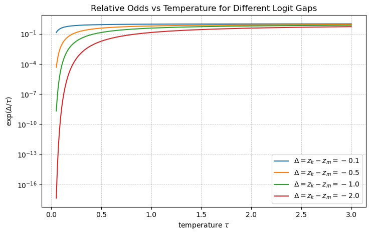

我们在调用大模型时，通常会设置两个参数：Temperature和Top-p。我们上网一查，都会说这两个参数可以控制大模型输出的随机性和多样性。但是，关于这两个参数的细节一直没有去了解，今天看了一个[视频](https://www.bilibili.com/video/BV1taSFBNEG4/?spm_id_from=333.337.search-card.all.click&vd_source=af1e89d4624a6f02ed73e2312d492273)，才对这两个参数为什么会影响大模型输出的随机性和多样性有了比较详细的了解，这里记录一下。

## 大模型是怎么输出的？
目前主流的大模型都是使用Next-Token-Prediction (NTP)这种范式，其本质上是给定前面的tokens，预测下一个token的条件概率分布：
$$
P(t_i|t_{<i})=\text{softmax}(\mathbf{z}_i) \tag{1}
$$
其中，$\mathbf{z}_i=\text{LLM}_{\theta}(t_{<i}) \in \mathbb{R}^{|V|}$是第$i$步输出的logits，$t_{<i}$是前面的tokens，$P(t_i|t_{<i})$是$t_i$给定$t_{<i}$的条件概率，$\theta$是模型的参数，$|V|$是词表的大小。

这其实是一个分类问题，我们假设整个Vocabulary（即所有可能的token）是$V$，那么大模型在第$i$步做的事情就是依据前面的$i-1$个token，从$V$中选择一个token作为第$i$个token的预测。

<!-- more -->

这个流程我们做AI的人肯定很熟悉，给定一个输入，让模型生成所有可能的类别（这里的类别就是$V$中的所有token）的置信度分数logits，然后对logits进行softmax归一化，得到每个token的概率分布。我们假设模型在预测第$i$个token时的输出logits为$\mathbf{z}_i$，则：
$$
\mathbf{z}_i = \text{LLM}_{\theta}(t_{<i}) = \begin{bmatrix}
    z^{0}_{i} \\
    z^{1}_{i} \\
    \vdots \\
    z^{|V|-1}_{i}
\end{bmatrix} \tag{2}
$$
那么模型选择词表$V$中的第$k$个token (记作$v_k$)作为句子的第$i$个token的概率为：
$$
P(t_i=v_k|t_{<i}) = \text{softmax}(\mathbf{z}_i)[k] = \frac{\exp(z^{k}_{i})}{\sum_{j=0}^{|V|-1} \exp(z^{j}_{i})} \tag{3}
$$
举个例子来说，假设$V$是一个包含4个token的词表$V=\{数学家,物理学家,音乐家,教育家\}$，第$i$个token之前的句子为：<span style="color:red;">"牛顿是一个"</span>，模型在第$i$步的输出logits为：
$$
\mathbf{z}_i = \begin{bmatrix}
    z^0_i=数学家 \\
    z^1_i=物理学家 \\
    z^2_i=音乐家 \\
    z^3_i=教育家
\end{bmatrix} = \begin{bmatrix}
    5.0 \\
    5.2 \\
    0.2 \\
    1.0
\end{bmatrix} \tag{4}
$$
那么模型选择每个token作为第$i$个token的概率分别为：
$$
\begin{aligned}
    & P(数学家|牛顿是一个) = \frac{e^{5.0}}{e^{5.0}+e^{5.2}+e^{0.2}+e^{1.0}} = 0.445 \\
    & P(物理学家|牛顿是一个) = \frac{e^{5.2}}{e^{5.0}+e^{5.2}+e^{0.2}+e^{1.0}} = 0.543 \\
    & P(音乐家|牛顿是一个) = \frac{e^{0.2}}{e^{5.0}+e^{5.2}+e^{0.2}+e^{1.0}} = 0.004 \\
    & P(教育家|牛顿是一个) = \frac{e^{1.0}}{e^{5.0}+e^{5.2}+e^{0.2}+e^{1.0}} = 0.008 \\
\end{aligned} \tag{5}
$$
这说明在“合理答案”里，模型不只给出了一个点预测，而是给出了一个分布。

## 选择哪一个token作为第$i$个token的预测结果？
按照我们之前做分类任务的经验，我们会选择概率最大的类别作为预测结果。在上面的例子中会选择<span style="color:red;">"物理学家"</span>作为第$i$个token的预测结果，因为$P(物理学家|牛顿是一个)$最高。如果我们每一步都取最大概率token：
$$
t_i = \arg\max_{k \in V} P(t_i=v_k|t_{<i}) = \arg\max_{k \in V} \text{softmax}(\mathbf{z}_i)[k] = v_{argmax} \tag{8}
$$
其中，$v_{argmax}$是使$P(t_i=v_{argmax}|t_{<i})$最大的$v_k$，这叫**贪心解码（greedy decoding）**。但是，常识告诉我们，<span style="color:red;">"数学家"</span>也是一个正确的结果，因为牛顿同样是一个数学家。如果只选择概率最高的类别作为预测结果，模型每次都只会选择<span style="color:red;">"物理学家"</span>，而抛弃了<span style="color:red;">"数学家"</span>这个同样合理且正确的结果。也就是说，只选择概率最高的类别作为预测结果，会降低模型输出的多样性（同样prompt基本永远得到同样结果）。

那我们如何增加模型输出的多样性呢？这个问题的本质就是从词表$V$中选择第$i$个token时不再只选择概率最高的类别，而是让其他的token也有机会被选择。有随机性的选择，用数学的语言来表达就是从某个分布中采样一个token作为第$i$个token的预测结果：
$$
t_i \sim p(\cdot) \tag{6}
$$
其中，$t_i$是第$i$个token的采样结果，$\sim$表示采样，$p(\cdot)$是第$i$个token的概率分布。这样一来，即使模型的输出logits不变，但是由于采样的随机性，在做第$i$步的预测时，也有可能选择到非概率最高的token。所以，**多样性来自于采样的随机性**。

### 多项式采样
那么，该从什么分布中采样呢？一个最直观的想法是直接将Softmax输出的概率看成一个多项式分布（Categorical Distribution），然后从这个分布中采样一个token作为第$i$个token的预测结果：
$$
t^i \sim \text{Cat}(\text{softmax}(\mathbf{z}_i)) \tag{7}
$$
其中，$\text{Cat}(\text{softmax}(\mathbf{z}_i))$表示一个多项式分布，其参数为$\text{softmax}(\mathbf{z}_i)$，即第$i$个token的概率分布。
代码实现如下：
```python
probs = torch.softmax(logits, dim=-1)
token = torch.multinomial(probs, num_samples=1)
```
但是一般大模型中的词表$V$都比较大，从几万到几十万不等，有很多token的概率非常低，直接从这个分布中采样一个token作为第$i$个token的预测结果，会有一些问题：
- **长尾噪声**：极小概率的token也有机会被选择到，导致模型偶尔输出很离谱的结果。
- **质量不稳定**：同样参数下输出波动大，导致生成的文本质量不稳定。
- 我们一般使用大模型的时候一般都会要求模型按照一定的格式要求进行输出，直接从多项式分布中采样一个token作为第$i$个token的预测结果，会**更容易导致格式崩坏**。

于是后面的采样方法基本都在回答同一个问题：如何做到**随机带来多样性**，但又**别抽到垃圾长尾token**？下面介绍一些常见的做法。

## Temperature
Temperature的做法是对模型输出的logits进行缩放：
$$
\mathbf{z}^{'}_i = \frac{\mathbf{z}_i}{\tau}, \quad \tau > 0 \tag{10}
$$
然后再进行Softmax：
$$
p(t_i=v_k|t_{<i}) = \text{softmax}(\mathbf{z}^{'}_i)[k] = \frac{\exp(\mathbf{z}^{k}_i/\tau)}{\sum_{j=0}^{|V|-1} \exp(\mathbf{z}^{j}_i/\tau)} \tag{11}
$$
选择第$i$个token时，我们依旧使用多项式分布$\text{Cat}(\text{softmax}(\mathbf{z}^{'}_i))$，只是参数换成了温度缩放之后的$\text{softmax}(\mathbf{z}^{'}_i)$。

为什么加一个缩放因子$\tau$之后，就能做到减少选到低概率token的风险？这是因为temperature改变了不同tokens的「相对赔率」（relative odds）。这里可以做一个证明：令logit最大的token为$m$，可以计算，任意token $k$与logit最大的token的概率比为：
$$
\frac{p_{\tau}(k)}{p_{\tau}(m)} = \frac{\exp(\mathbf{z}^{k}_i/\tau)}{\exp(\mathbf{z}^{m}_i/\tau)} = \exp\left(\frac{\mathbf{z}^{k}_i - \mathbf{z}^{m}_i}{\tau}\right) \tag{12}
$$
如图1所示，由于$\exp(\mathbf{z}^{k}_i - \mathbf{z}^{m}_i) \geq 0, \tau > 0$，所以
<figure>

<figcaption>图1：温度对相对赔率的影响</figcaption>
</figure>

- 当$\Delta=z_k-z_m < 0$固定时，函数$\exp(\Delta/\tau)$随着$\tau$的增加而增加，即相对赔率增加，也就是说，增大$\tau$会使模型输出的低概率token的概率增加，从而增加模型输出的多样性。
- 当$\tau \rightarrow 0$时，函数$\exp(\Delta/\tau)$会趋向于$0$，即相对赔率会趋向于$0$，也就是说，当$\tau$很小时，模型输出的低概率token的概率会趋向于$0$，从而减少模型输出的多样性。
- 当$\tau \rightarrow \infty$时，函数$\exp(\Delta/\tau)$会趋向于$1$，即相对赔率会趋向于$1$，也就是说，采样的分布会趋向于均匀分布，变成完全随机采样。

我们还是以前面提到的例子，假设$V=\{数学家,物理学家,音乐家,教育家\}$，第$i$个token之前的句子为：<span style="color:red;">"牛顿是一个"</span>，则：

<table>
  <caption>表1：温度对softmax输出的影响</caption>
  <thead>
    <tr>
      <th rowspan="2">tokens</th>
      <th rowspan="2">$z_k$</th>
      <th colspan="2">$\tau=0.1$</th>
      <th colspan="2">$\tau=1.0$</th>
      <th colspan="2">$\tau=10.0$</th>
    </tr>
    <tr>
      <th>$z_k/\tau$</th>
      <th>$\text{softmax}(z_k/\tau)$</th>
      <th>$z_k$</th>
      <th>$\text{softmax}(z_k)$</th>
      <th>$z_k/\tau$</th>
      <th>$\text{softmax}(z_k/\tau)$</th>
    </tr>
  </thead>

  <tbody>
    <tr>
      <td>数学家</td>
      <td>5.0</td>
      <td>50.0</td>
      <td>0.119</td>
      <td>5.0</td>
      <td>0.445</td>
      <td>0.5</td>
      <td>0.302</td>
    </tr>
    <tr>
      <td>物理学家</td>
      <td>5.2</td>
      <td>52.0</td>
      <td>0.881</td>
      <td>5.2</td>
      <td>0.543</td>
      <td>0.52</td>
      <td>0.308</td>
    </tr>
    <tr>
      <td>音乐家</td>
      <td>0.2</td>
      <td>2.0</td>
      <td>0</td>
      <td>0.2</td>
      <td>0.004</td>
      <td>0.02</td>
      <td>0.187</td>
    </tr>
    <tr>
      <td>教育家</td>
      <td>1.0</td>
      <td>10.0</td>
      <td>0</td>
      <td>1.0</td>
      <td>0.008</td>
      <td>0.1</td>
      <td>0.203</td>
    </tr>
  </tbody>
</table>

从表1可以看出，当$\tau$小时，模型输出的分布很确定，只有一个token的概率很大，其他token的概率都很小；当$\tau$很大时，模型输出的分布很随机，每个token的概率都差不多。这种$\tau$小的时候输出趋于确定，而$\tau$大的时候输出趋于随机，跟物理学中的温度概念很像，温度低的时候，系统更稳定；温度高的时候，系统更不稳定，这也符合我们的直观感受，这也是温度这个参数的一个物理意义。

Temperature的代码实现如下：
```python
probs = torch.softmax(logits / tau, dim=-1)
token = torch.multinomial(probs, num_samples=1)
```

### Top-k
Top-k的解决思路很简单，就是直接把概率排名第$k$以下的长尾token直接砍掉，只保留概率排名第$k$以上的token，然后从这些token中采样一个token作为第$i$个token的预测结果，从而大幅减少“低概率怪词”事故的发生。

设$S_k$是概率最高的$k$个token的集合，即$S_k = \{t^1, t^2, \dots, t^k\}$，那么模型选择第$i$个token的概率分布为：
$$
p(t_i=v_k|t_{<i}) = \begin{cases}
    \frac{\exp(\mathbf{z}^{k}_i)}{\sum_{j \in S_k} \exp(\mathbf{z}^{j}_i)} & \text{if } v_k \in S_k \\
    0 & \text{otherwise}
\end{cases} \tag{8}
$$
工程上常用`mask logits`实现：对不在集合内的token令logit=$-\infty$，再softmax，自然完成“重新归一化”。代码实现如下：
```python
values, _ = torch.topk(logits, k)
kth = values[-1]
filtered = logits.clone()
filtered[filtered < kth] = -torch.inf

probs = torch.softmax(filtered, dim=-1)
token = torch.multinomial(probs, 1)
```
top-k的优点是简单，速度快，但是$k$是固定的，比如设置为50，当分布很尖时，top-50里很多token都很不合理（“应该只留 2~5 个”），分布很平时，top-50可能又太少，导致表达受限、重复、模式化。也就是候选集没法随分布自适应变化。

### Top-p（nucleus sampling）
为了解决top-k候选集大小固定的问题，引入top-p（nucleus sampling）。Top-p的解决思路也很简单，就是把token按概率从大到小排序得到序列$(t^1, t^2, \dots, t^{|V|})$，取最小$m$满足累计概率：
$$
C_m = \sum_{r=1}^m p(t^r) \geq p_{\text{nuc}} \tag{9}
$$
保留$C_m=\{t^1, t^2, \dots, t^m\}$，并在其中重新归一化，此时选择第$i$个token的概率分布为：
$$
p(t_i=v_k|t_{<i}) = \begin{cases}
    \frac{\exp(\mathbf{z}^{k}_i)}{\sum_{j \in C_m} \exp(\mathbf{z}^{j}_i)} & \text{if } v_k \in C_m \\
    0 & \text{otherwise}
\end{cases} \tag{10}
$$
代码实现如下：
```python
probs = torch.softmax(logits, dim=-1)
sorted_probs, sorted_idx = torch.sort(probs, descending=True)
cumprobs = torch.cumsum(sorted_probs, dim=-1)

cut = cumprobs > top_p
cut[..., 0] = False
cut = cut.roll(shifts=1, dims=-1)
cut[..., 0] = False

filtered = logits.clone()
filtered[sorted_idx[cut]] = -torch.inf

probs = torch.softmax(filtered, dim=-1)
token = torch.multinomial(probs, 1)
```

## 总结
Temperature、Top-k、Top-p都是常用的模型输出控制方法，它们的区别如下：
- **Temperature控制的是不同token的概率差距**，调低温度值$\tau$，会拉大不同token的概率差距，从而使模型选择输出Token更确定；而调高温度值$\tau$，会缩小不同token的概率差距，从而使模型选择输出Token更随机，增加模型输出的多样性。
- **Top-k控制的是模型输出的候选集大小**，调低$k$，会减少模型输出的候选集大小，从而使模型的输出结果更确定；而调高$k$，会增加模型输出的候选集大小，从而使模型的输出结果更随机，增加模型输出的多样性。
- **Top-p控制的是长尾Token的概率阈值**，调低阈值，会去掉更多的长尾token，从而使模型的输出结果更确定；而调高阈值，会保留更多的长尾token，从而使模型的输出结果更随机，增加模型输出的多样性。