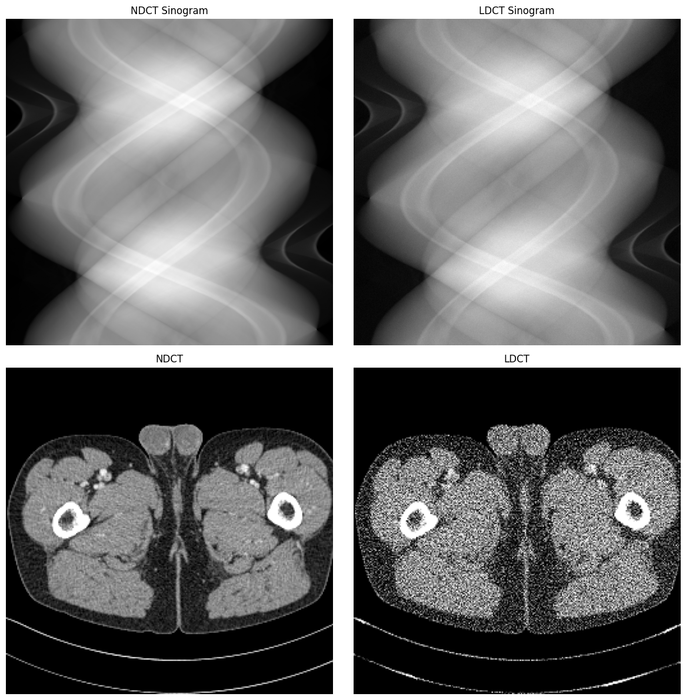
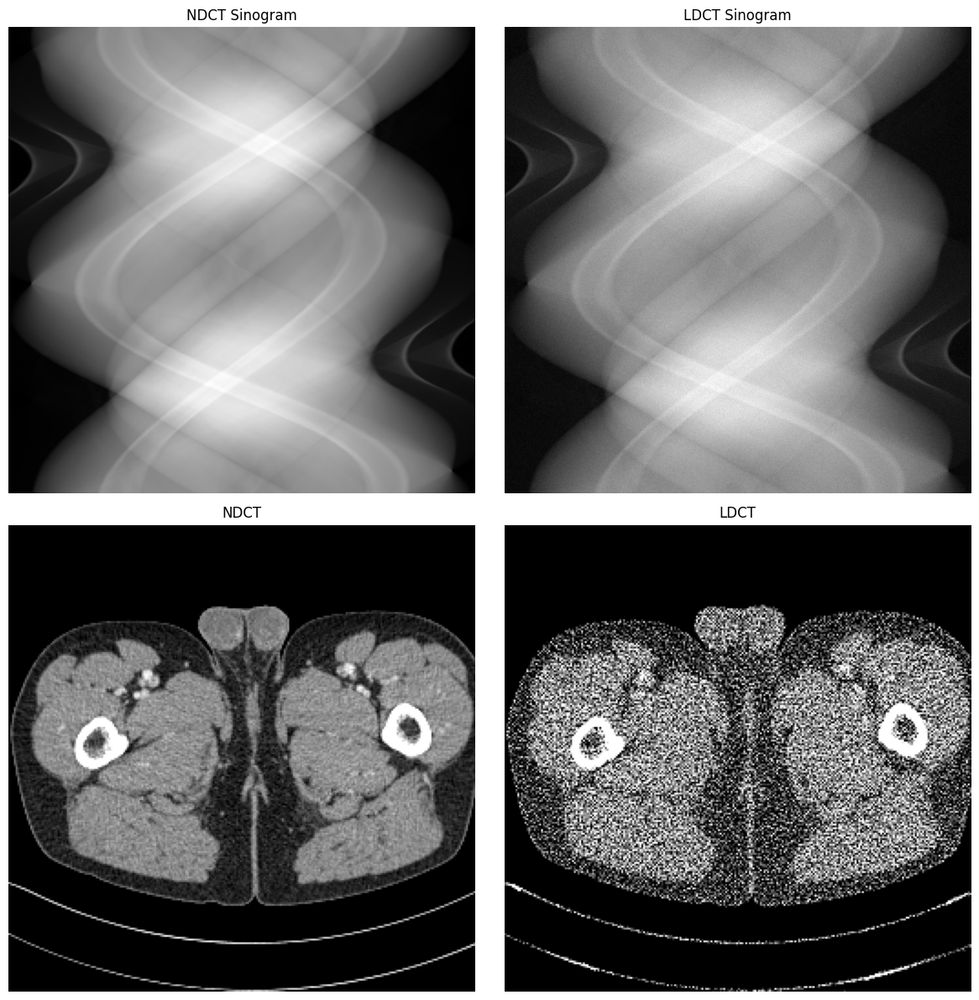

在医学成像中，低剂量CT（Computed Tomography）扫描是一种常用的技术，旨在减少患者接受的辐射剂量。然而，降低辐射剂量通常会导致图像质量下降，主要表现为噪声增加。为了研究和改进低剂量CT图像的处理方法，我们需要模拟低剂量CT图像中的噪声特性。

## 光子计数的泊松分布模拟
从上一篇文章《[CT投影和泊松噪声的关系](./posts/ct-proj-and-poisson.html)》中，我们知道，在理想的、无噪声的世界里，X 射线穿过物体遵循 Beer-Lambert 定律:
$$N = N_0 \cdot e^{-\mu l} = N_0 \cdot e^{-p_{\text{ICT}}} \tag{1}$$
其中，$N_0$是入射到物体上的 X 射线光子数，$N$是穿过物体后到达探测器的 X 射线光子数，$\mu$是物体的线性衰减系数，$l$是射线穿过物体的路径长度，$p_{\text{ICT}}$是**理想线积分值**(True Line Integral)，也即CT的投影值，这是我们想要测量的物理量，则:
$$p_{\text{ICT}} = -\ln\left(\frac{N}{N_0}\right) \tag{2}$$

在现实世界中，光子的发射和探测是一个随机过程。即$N$不再是一个确定值，而是一个服从泊松分布的随机变量:
$$N \sim \text{Poisson}(N_0 \cdot e^{-p_{\text{ICT}}}) \tag{3}$$
<!-- more -->

在低剂量CT扫描中，入射光子的强度会降低，假设降低的比例为$\alpha$（$0 < \alpha < 1$），即$N_0^{'} = \alpha N_0$，那么低剂量CT下探测器接收到的光子数量可以表示为：
$$N_{\text{LDCT}} \sim \text{Poisson}(\alpha N_0 \cdot e^{-p_{\text{ICT}}}) \tag{4}$$

那么，我们只要从式(4)中采样，就可以得到模拟的低剂量CT系统中探测器接收到的光子数量$N_{\text{LDCT}}$。然后计算出对应的低剂量CT投影值$p_{\text{LDCT}}$：
$$p_{\text{LDCT}} = -\ln\left(\frac{N_{\text{LDCT}}}{N_0^{'}}\right) = -\ln\left(\frac{N_{\text{LDCT}}}{\alpha N_0}\right) \tag{5}$$

代码示例（Python）：

```python
import torch

def poisson_noise_simulation(p_ict, N0, alpha=1.0):
    """
    p_ict: full-dose sinogram (line integral)
    N0:    full-dose 入射光子数
    alpha: 剂量缩放因子 (0<alpha<=1)
    """
    N0_ldct = N0 * alpha                  # 低剂量下的 N0
    # 1) full-dose 透过率 -> 低剂量 photon 期望
    lam = N0_ldct * torch.exp(-p_ict)     # λ = N0_ldct * exp(-p)
    # 2) Poisson 噪声
    I_ldct = torch.poisson(lam)
    # 3) 反算回 line integral
    p_ldct = -torch.log(I_ldct / N0_ldct)
    return p_ldct
```
下面展示一个低剂量CT噪声模拟的示例，假设入射光子数$N_0=1e5$，剂量缩放因子$\alpha=0.25$（即25%剂量）的情况下的模拟结果：
<figure>
  
  <figcaption>25%剂量CT噪声模拟示例</figcaption>
</figure>

## 投影域高斯噪声仿真
然而CT系统记录的不是$N$，而是通过对数变换得到的投影数据$p_{\text{measured}}$：
$$p_{\text{measured}} = -\ln\left(\frac{N}{N_0}\right) \tag{6}$$
由于$N$是随机的，$p_{\text{measured}}$ 也是一个随机变量。我们的任务就是精确地刻画$p_{\text{measured}}$的统计特性（均值和方差）。Whiting et al.(2006)在其论文的Section II.A.4中明确指出：
> "As exposure increases, the pdf will approach a Gaussian distribution characterized by a mean $\kappa_1 I$ and variance $\kappa_2 I$, with negligible higher moments, as expected from the central limit theorem."

也就是说，当入射光子数$N_0$较大时，其概率密度函数会趋近于一个高斯分布，其高阶矩（如偏度、峰度）可以忽略不计，这是中心极限定理的预期结果。而且论文Introduction中还给出了结论：**当检测到的光子数$N > 20$时，泊松分布与高斯分布的差异已经非常小，高斯近似是足够精确的。**

为了验证这一点，我们可以绘制多组不同$\lambda$下的泊松概率质量函数（PMF）与对应高斯概率密度函数（PDF）的对比曲线，如下图所示：
<figure>
  
  <figcaption>不同$\lambda$下泊松分布与高斯分布对比</figcaption>
</figure>

从图中可以看到，当$\lambda$较小时（如$\lambda=1$），泊松分布与高斯分布有明显差异；而当$\lambda$增大（如$\lambda=20$及以上，$\lambda$是光子计数的平均值，也就是说平均的光子计数>=20）时，泊松分布与高斯分布几乎重合。因此，在实际的CT成像中，由于入射光子数通常较大，我们可以使用高斯分布来近似描述投影数据$p_{\text{measured}}$的统计特性。

由于我们已知光子计数$N$服从泊松分布，其均值和方差均为$\lambda = N_0 e^{-p_{\text{ICT}}}$（泊松分布的均值和方差相等）。根据前面的讨论，当$N$较大时，我们可以近似地认为$N$服从高斯分布：$N \sim \mathcal{N}(\mu, \sigma^2)$，其中均值$\mu=\lambda=N_0 e^{-p_{\text{ICT}}}$，方差$\sigma^2=\lambda=N_0 e^{-p_{\text{ICT}}}$。

而我们要计算的投影数据$p_{\text{measured}}$是$N$的对数变换，因此我们可以使用**Delta方法**来近似计算$p_{\text{measured}}$的均值和方差。
> Delta方法指出，如果$X$是一个随机变量，其均值和方差分别是$\mu$和$\sigma^2$，$g(X)$是一个可微函数，那么当$X$的方差较小时，$g(X)$的方差可以近似表示为：
$$\text{Var}(g(X)) \approx [g'(\mu)]^2 \cdot \sigma^2$$
> Delta方法的直观理解是：当$X$在$\mu$附近波动时，$g(X)$的变化可以用泰勒展开的一阶项来近似，因此其方差可以通过一阶导数来估计，其理论依据是泰勒展开，详见[维基百科：Delta method](https://en.wikipedia.org/wiki/Delta_method)。

在这里：
- $X$是光子计数$N$；
- $g(X) = -\ln\left(\frac{N}{N_0}\right)$；
- $g^{'}(X)=-\frac{1}{N}$.

因此，投影数据$p_{\text{measured}}$的均值和方差可以近似表示为：
$$\mathbb{E}[p_{\text{measured}}] = -\ln\left(\frac{\mu}{N_0}\right) = -\ln\left(\frac{N_0 e^{-p_{\text{ICT}}}}{N_0}\right) = p_{\text{ICT}} \tag{7}$$
$$\text{Var}(p_{\text{measured}}) \approx \left(-\frac{1}{\mu}\right)^2 \cdot \sigma^2 = \frac{1}{\mu^2} \cdot \mu = \frac{1}{\mu} = \frac{e^{p_{\text{ICT}}}}{N_0} \tag{8}$$
即可以得到$p_{\text{measured}}$服从均值为$p_{\text{ICT}}$,方差为$\frac{e^{p_{\text{ICT}}}}{N_0}$的高斯分布：
$$p_{\text{measured}}\sim \mathcal{N} \left( p_{\text{ICT}}, \frac{e^{p_{\text{ICT}}}}{N_0}\right)$$
现在，我们将上述通用模型应用到具体的全剂量和低剂量场景。

### 全剂量CT投影噪声模型
对于全剂量CT扫描，入射光子数为$N_0$，因此全剂量CT投影数据$p_{\text{FDCT}}$的统计模型为：
$$p_{\text{FDCT}}=p_{\text{ICT}} + \sqrt{\frac{e^{p_{\text{ICT}}}}{N_0}} \cdot x,\quad x\sim \mathcal{N}(0,1) \tag{9}$$

### 低剂量CT投影噪声模型
同理，低剂量CT扫描中，入射光子数为$N_0^{'}=\alpha N_0$，因此低剂量CT投影数据$p_{\text{LDCT}}$的统计模型为：
$$p_{\text{LDCT}}=p_{\text{ICT}} + \sqrt{\frac{e^{p_{\text{ICT}}}}{\alpha N_0}} \cdot x,\quad x\sim \mathcal{N}(0,1) \tag{10}$$

注意：这里我们假设$p_{\text{FDCT}}$和$p_{\text{LDCT}}$是对同一个理想值$p_{\text{ICT}}$的两次独立测量，因此它们共享同一个随机变量$x$（或至少是同分布的）。

我们现在面临一个实际问题：我们只有$p_{\text{FDCT}}$，没有$p_{\text{ICT}}$，如何从$p_{\text{FDCT}}$合成$p_{\text{LDCT}}$？最自然的构造方式是：
$$p_{\text{LDCT}} = p_{\text{FDCT}} + \text{Noise}_{\text{add}} \tag{11}$$
其中，$\text{Noise}_{\text{add}}$是我们需要添加的噪声项。为了使$p_{\text{LDCT}}$满足式(10)的统计特性，我们可以推导出$\text{Noise}_{\text{add}}$的均值和方差：
$$\text{Mean}(\text{Noise}_{\text{add}}) = \text{Mean}(p_{\text{LDCT}}) - \text{Mean}(p_{\text{FDCT}}) = p_{\text{ICT}} - p_{\text{ICT}} = 0$$
$$\begin{aligned}
\text{Var}(\text{Noise}_{\text{add}}) &= \text{Var}(p_{\text{LDCT}}) - \text{Var}(p_{\text{FDCT}}) \\ &= \frac{e^{p_{\text{ICT}}}}{\alpha N_0} - \frac{e^{p_{\text{ICT}}}}{N_0} \\ &= e^{p_{\text{ICT}}} \left( \frac{1}{\alpha N_0} - \frac{1}{N_0} \right) \\ &= \frac{e^{p_{\text{ICT}}}}{N_0} \left( \frac{1 - \alpha}{\alpha} \right) 
\end{aligned} \tag{12}$$
公式(12)中仍然包含未知的理想值$p_{\text{ICT}}$，这是无法直接用于仿真的。Yu et al. 的核心洞见是：全剂量CT是一个高信噪比（SNR）的测量，因此，我们可以用$p_{\text{FDCT}}$作为$p_{\text{ICT}}$的一个比较好的近似：
$$p_{\text{ICT}} \approx p_{\text{FDCT}} \tag{13}$$
将式(13)代入式(12)中，我们得到了最终的，完全可操作的低剂量CT投影噪声的添加模型：
$$\text{Noise}_{\text{add}} \sim \mathcal{N} \left( 0, \frac{e^{p_{\text{FDCT}}}}{N_0} \left( \frac{1 - \alpha}{\alpha} \right) \right) \tag{14}$$
也即：
$$\text{Noise}_{\text{add}} = 0 + \sqrt{\frac{e^{p_{\text{FDCT}}}}{N_0} \left( \frac{1 - \alpha}{\alpha} \right)} \cdot x,\quad x\sim \mathcal{N}(0,1)$$
带入到式(11)中，我们最终得到了从全剂量CT投影数据$p_{\text{FDCT}}$合成低剂量CT投影数据$p_{\text{LDCT}}$的公式：
$$p_{\text{LDCT}} = p_{\text{FDCT}} + \sqrt{\frac{e^{p_{\text{FDCT}}}}{N_0} \left( \frac{1 - \alpha}{\alpha} \right)} \cdot x,\quad x\sim \mathcal{N}(0,1) \tag{15}$$
代码示例（Python）：

```python
import torch
def gaussian_noise_simulation(p_fdct, N0, alpha=1.0):
    """
    p_fdct: full-dose sinogram (line integral)
    N0:     full-dose 入射光子数
    alpha:  剂量缩放因子 (0<alpha<=1)
    """
    scale = ((1 - alpha) / alpha) ** 0.5
    # 计算噪声的标准差
    noise_std = torch.sqrt(torch.exp(p_fdct) / N0) * scale
    # 生成高斯噪声
    x = torch.randn_like(p_fdct)
    noise_add = noise_std * x
    # 合成低剂量投影
    p_ldct = p_fdct + noise_add
    return p_ldct
```
下面展示一个低剂量CT噪声模拟的示例，假设入射光子数$N_0=1e5$，剂量缩放因子$\alpha=0.1$（即10%剂量）的情况下的模拟结果：
<figure>
  
  <figcaption>10%剂量CT高斯噪声模拟示例</figcaption>
</figure>

## 参考文献
1. Yu, Lifeng, et al. "Development and validation of a practical lower-dose-simulation tool for optimizing computed tomography scan protocols." Journal of computer assisted tomography 36.4 (2012): 477-487.
2. NIH, AAPM, Clinic, M.: Low Dose CT Grand Challenge. https://www.aapm.org/GrandChallenge/LowDoseCT/ (2016).
3. Whiting, Bruce R., et al. "Properties of preprocessed sinogram data in x‐ray computed tomography." Medical physics 33.9 (2006): 3290-3303.
4. Liu, Yuxin, et al. "Imaging foundation model for universal enhancement of non-ideal measurement ct." arXiv preprint arXiv:2410.01591 (2024).